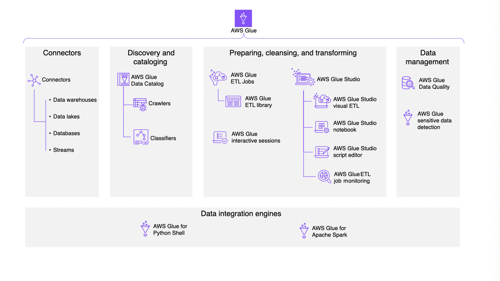

# Transform data

---

## Processing the data
Ingested data will be in different, varying formats and quality. It needs to be processed for later analysis stages.

The terms preparation, cleansing, and transforming are often used to describe actions in the processing stage. Those actions are performed using extract, transform, and load (ETL) functions.

* **Extract**: Gathering data from a variety of data sources.
* **Transform**: Systematically changing raw data into usable formats.
* **Load**: Moving the transformed data into data lake storage or another location.

---

## Multiple ways to transform and clean data

### Big data processing

* Amazon EMR on EC2 clusters
* Amazon EMR Serverless
* Amazon EMR on EKS clusters

### Amazon Athena
* Impromptu log analysis
* Report generation
* Business intelligence

### Amazon EventBridge with AWS Step Functions and Amazon Managed Workflows for Apache Airflow
* For scheduling and orchestration

---

## AWS Glue

AWS Glue is a serverless data integration service that makes it convenient to integrate data from multiple sources.

As it is serverless, we don't need to provision or configure any infrastructure.

AWS Glue is a multifaceted service and provides a wide range of features and functions for processing data.

We can develop ETL jobs in AWS Glue with visual ETL, notebooks, a script editor with SageMaker Studio, and local IDEs. In each case, we need to run code in an underlying serverless distributed Spark engine.

---

## Connectors

A connector is a piece of code that facilitates communication between AWS Glue and a data store.

We can use built-in connectors or connectors offered in the AWS Marketplace.

Examples of connectors include the following:

* **Data warehouses**: Amazon Redshift
* **Data lakes**: Amazon S3
* **Relational databases**: JDBC, Amazon Aurora, MariaDB, MySQL, Microsoft SQL Server, Oracle Database, PostgreSQL
* **Non-relational databases**: Amazon DocumentDB, MongoDB, Amazon OpenSearch
* **Streams**: Apache Kafka, Amazon Kinesis
* **Other cloud providers**

---

## Discovery and cataloging
Data will likely be stored in several formats with varying quality and accessibility. After being ingested into the data lake storage, it needs to be cataloged so that it is searchable.

---

## Glue Data Catalog
The AWS Glue Data Catalog is the central metadata repository for all data assets in the data lake. The catalog consists of a collection of tables organized within databases.