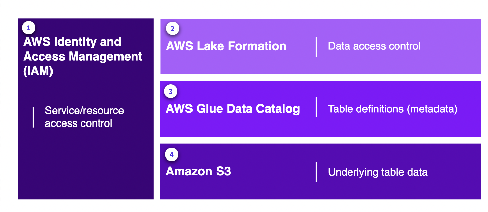

# Security Using AWS Lake Formation

Several aspects contribute to data lake security, including data network security, access management, regulatory compliance, and sensitive data protection.

AWS offers services like **IAM (Identity and Access Management)**, **AWS CloudTrail**, **Amazon Macie**, and **AWS Key Management Service (KMS)** to address these aspects.

We can use IAM to configure policies that allow access for IAM principals to specific S3 buckets. We can also grant permissions for specific AWS Glue APIs, such as `GetTable`, `CreateTable`, and `UpdateTable`.

---
## Security Components of AWS

### IAM (Identity and Access Management)
* Create and manage IAM users, groups, and roles with different levels of access.
* Configure access control policies based on resources, actions, and conditions.
* Grant or deny access to resources and AWS services.

### Lake Formation
* Integrates with Data Catalog for metadata management and data discovery.
* Serves as a centralized, fine-grained data access control policy store. It allows analytics tools to retrieve and enforce user permissions for accessing data within the data lake.
* Automatically creates and maintains audit logs for data access and changes.

### AWS Glue Data Catalog
* The Data Catalog is a central repository that stores metadata about your data sources, such as data on Amazon S3.
* Lake Formation can be used to set permissions at the column and row level on catalog metadata.

---
## How IAM and Lake Formation Work Together

IAM manages authentication and authorization, including for Lake Formation. IAM policies define permissions for Lake Formation resources and data. Lake Formation provides additional data access control and governance capabilities specific to data lakes, such as fine-grained access and tagging.

We can assign permissions to different types of principals:

* IAM users and roles
* AWS IAM Identity Center users and groups
* SAML 2.0 and Amazon QuickSight users and groups
* External AWS accounts, external AWS organizations, or external IAM users and roles

---
## Major Steps for Setting Up Security in a Data Lake

1.  **Configure IAM**: Set up initial users, groups, roles, and baseline permissions.
2.  **Enable Lake Formation in the AWS Region**: Designate administrators and configure initial settings.
3.  **Register Data Sources**: Add S3 paths and Glue databases/tables to be managed by Lake Formation.
4.  **Define Data Access Policies**: Grant fine-grained permissions (database, table, column, row-level) to principals.
5.  **Integrate with Other AWS Services**: Ensure services like Athena, Redshift Spectrum, EMR, and Glue crawlers/ETL jobs can leverage Lake Formation permissions.
6.  **Monitor and Audit**: Use CloudTrail and Lake Formation audit logs to track access and policy changes.