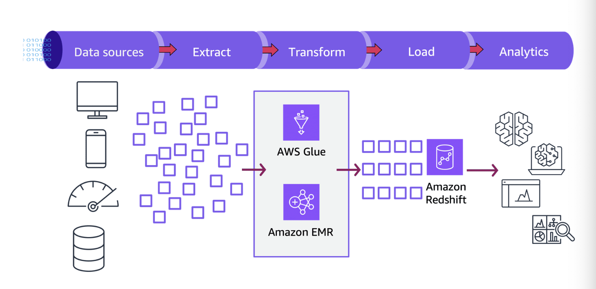
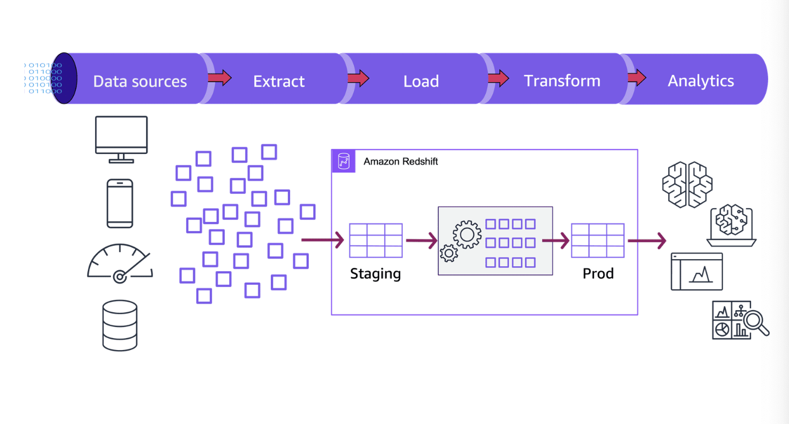

# Data Processing

Importing data into an AWS environment, whether based on an event or a scheduled batch (monthly, weekly, or daily), often requires transformation and augmentation. This can be approached in two primary ways: ETL (Extract, Transform, Load) or ELT (Extract, Load, Transform).

AWS Lambda functions are a versatile tool for these processes. They can extract data and perform transformations such as data cleansing, filtering, formatting, and enrichment. Various events can trigger Lambda functions, including file uploads to S3, changes in a DynamoDB table, or updates to a Kinesis stream. It is also possible to chain Lambda functions using services like Simple Notification Service (SNS) or Simple Queue Service (SQS) to build multi-step ETL or ELT workflows.

---

## ETL (Extract, Transform, Load)

ETL operations are well-defined workflows that typically run on a schedule or are triggered by the arrival of new data. The workflow begins with an initial event, extracts the data, transforms it, and finally loads it into the destination.

### Extract

Data can be extracted using various tools and services.

* **Lambda**: Lambda functions can initiate the extraction process based on events like the arrival of new data or a scheduled time. These functions can then invoke other AWS services such as AWS Glue or Amazon EMR to perform the heavy lifting of the extraction.
* **AWS Glue**: This serverless data integration service can automatically discover data formats and schemas, which simplifies extracting data from diverse sources.
* Other tools include the `COPY` command in Amazon Redshift, the Amazon Redshift Data API, and AWS Database Migration Service (DMS).

### Transform

After extraction, data must be altered to meet the requirements of the target system before loading.

* **AWS Glue**: Glue is well-suited for many transformation tasks. It provides a serverless, Spark-based ETL engine that can be used to define and execute data transformations.
* **Ray**: For scaling Python workloads, Ray is a distributed framework that enables parallel processing, overcoming the limitations of libraries like Pandas that do not natively support it.
* **Amazon EMR**: For computationally intensive transformations, Amazon EMR is the preferred choice. It is a managed Hadoop framework that includes tools like Apache Spark and Hive, which are powerful for complex data transformations.

### Load

Once transformed, the data is loaded into the target data warehouse.

* **AWS Glue**: Can be used to load transformed data into destinations like Amazon Redshift.
* **Amazon EMR**: Can also load data directly into Amazon Redshift.

---

## ELT (Extract, Load, Transform)

In the ELT workflow, data is first extracted and loaded into the target system, and then transformed.

An ELT workflow also starts with an initial event (e.g., file upload, API call, scheduled trigger). Data is extracted and typically stored in a staging area like Amazon S3. AWS Glue crawlers can then be used to discover the metadata and populate the AWS Glue Data Catalog. From S3, the data is loaded into Amazon Redshift using the `COPY` command. The transformation then occurs within Redshift itself.

### Extract and Load

* **Extraction**: Data can be extracted using **AWS DMS** for on-premises or relational databases, and **AWS Glue** for various other data stores. **Amazon S3** serves as a temporary storage layer for extracted data before it is loaded into Redshift.
* **Loading**: The **Amazon Redshift `COPY` command** is highly optimized for loading large volumes of data from Amazon S3.

### Transform

During this phase, data undergoes transformation within the data warehouse. These transformations are typically performed using **SQL queries**. This can include joining tables, filtering records, aggregating data, formatting values, and creating derived columns or views. The massively parallel processing (MPP) architecture and advanced SQL features of Amazon Redshift are leveraged to perform these transformations efficiently at scale.

---

## Advanced Redshift Features for Transformation

### Aggregation Extensions

Amazon Redshift supports powerful SQL extensions that can perform the work of multiple `GROUP BY` operations in a single statement. These include:
* `GROUPING SETS`
* `ROLLUP`
* `CUBE`
* `GROUPING`/`GROUPING_ID` functions
* Partial `ROLLUP` and `CUBE`
* Concatenated and nested groupings

### User-Defined Functions (UDFs)

Amazon Redshift allows the creation and execution of user-defined scalar functions (UDFs) and user-defined stored procedures (UDPs) using Python or SQL.

* **Scalar UDFs**: Analysts can create custom scalar UDFs using either a SQL `SELECT` clause or a Python program. For Python UDFs, you can use standard Python functionality and import custom modules.
* **Lambda UDFs**: You can create Lambda UDFs that use custom functions defined in AWS Lambda as part of your SQL queries. This allows for more complex UDFs and integration with other AWS services and third-party components. Lambda UDFs can be written in any language supported by Lambda, such as **Java, Go, PowerShell, Node.js, C#, Python, and Ruby**.

### Amazon Redshift Stored Procedures

Amazon Redshift supports stored procedures written in the PL/pgSQL dialect. They encapsulate a set of SQL statements and can include variable declarations, control logic (IF, CASE, LOOP), and error handling.

**Benefits of Stored Procedures:**

| Feature | Description |
| :--- | :--- |
| **Procedural Logic** | Implement complex control flow, variable declarations, and error handling directly within the data warehouse. |
| **Performance** | Reduce network roundtrips between the client and the Redshift cluster by executing the entire procedure on the server. |
| **Security** | Grant permissions to run a procedure separately from the underlying tables, enabling fine-grained access control. |
| **Reusability** | Promote code reuse across different applications by encapsulating logic in a central procedure. |
| **Maintenance** | Centralize logic for specific tasks, making it easier to maintain and update code as requirements change. |
| **Transaction Mgt.** | Ensure data consistency by wrapping multiple SQL statements within a single transaction. |
| **Temporary Tables** | Create temporary tables within procedures for intermediate data processing or staging. |
| **Debugging** | Utilize Redshift tools for debugging and monitoring, such as logging and profiling. |
| **Limitations** | Stored procedures cannot be called recursively, and there are restrictions on certain SQL statements that can be used within them. |

### Materialized Views

Materialized views in Amazon Redshift are pre-computed views that store the result of a complex query on large tables for faster access. They improve query performance by minimizing the need to recalculate the results of underlying queries that are performed repeatedly.

---

## Deep Dive into Transformation Tools

### Amazon EMR

Amazon EMR is a managed cluster platform that simplifies running big data frameworks like Apache Hadoop and Apache Spark on AWS. It is ideal for processing and analyzing vast amounts of data.
* **Use Cases**: Use EMR to transform and move large volumes of data in and out of other AWS data stores like Amazon S3 and Amazon DynamoDB.
* **Serverless Option**: **Amazon EMR Serverless** is a deployment option that allows you to run Spark and Hudi applications without managing the underlying compute resources. It automatically provisions and scales resources based on workload, reducing operational overhead and optimizing costs.

### AWS Glue

AWS Glue is a serverless data integration service used to discover, prepare, move, and integrate data from over 70 sources.
* **Capabilities**: Includes data discovery, modern ETL, data cleansing, transformation, and a centralized data catalog. Being serverless means there is no infrastructure to manage.
* **Integration**: Integrates tightly with AWS analytics services and Amazon S3 data lakes. It scales for any data size and supports all data types and schema variances.

### AWS Lambda

AWS Lambda can be used with Amazon Redshift for various data processing, loading, and transformation tasks.
* **Data Loading**: Load data from sources like S3, DynamoDB, or Kinesis into Redshift. Lambda functions can be triggered by events from these sources to process the data and load it using the Redshift Data API.
* **Data Transformations**: Perform pre-load transformations like cleaning, filtering, or aggregating data before inserting it into Redshift tables.
* **Scheduled Tasks**: Use Lambda with Amazon CloudWatch Events to schedule recurring tasks like running queries, generating reports, or performing maintenance.
* **Event-Driven Processing**: Trigger a Lambda function when a new file is uploaded to an S3 bucket to automatically load its data into a Redshift table.
* **Redshift Automation**: Automate administrative tasks such as resizing clusters, creating snapshots, or running `VACUUM` and `ANALYZE` operations.

